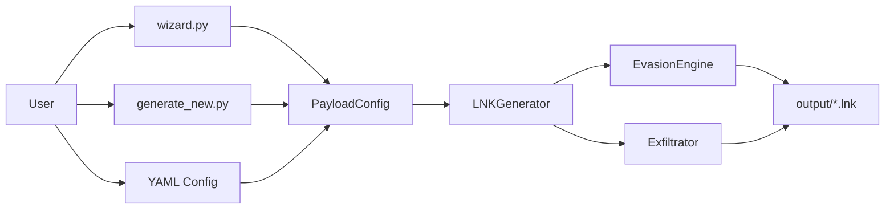

# LNKUp - Advanced LNK Payload Generator

<div align="center">


**Modern red teaming tool per la generazione di file Windows shortcut (`.lnk`) weaponizzati**

[Get Started](getting-started/installation.md){ .md-button .md-button--primary }
[Wizard Guide](usage/wizard.md){ .md-button }
[GitHub](https://github.com/yourusername/LNKUp){ .md-button }

</div>

---

## :fire: Features

<div class="grid cards" markdown>

-   :lock: **NTLM Hash Capture**

    ---

    Cattura credenziali senza interazione utente tramite icon loading automatico

    [:octicons-arrow-right-24: Learn more](payloads/ntlm-capture.md)

-   :bar_chart: **Environment Exfiltration**

    ---

    Reconnaissance via variabili di sistema Windows embedded nei path UNC

    [:octicons-arrow-right-24: Learn more](payloads/env-exfil.md)

-   :zap: **Command Execution**

    ---

    Esecuzione di payload PowerShell arbitrari con obfuscation e evasion

    [:octicons-arrow-right-24: Learn more](payloads/command-exec.md)

-   :shield: **Advanced Evasion**

    ---

    AMSI bypass, LOLBAS proxy execution, timestamp spoofing e altro

    [:octicons-arrow-right-24: Learn more](evasion/amsi.md)

-   :globe_with_meridians: **Multi-Protocol**

    ---

    Supporto per UNC/SMB, WebDAV, HTTP/HTTPS exfiltration

    [:octicons-arrow-right-24: Learn more](payloads/webdav.md)

-   :mage: **Interactive Wizard**

    ---

    Interfaccia guidata con spiegazioni dettagliate per ogni opzione

    [:octicons-arrow-right-24: Learn more](usage/wizard.md)

</div>

---

## :rocket: Quick Example

=== "Wizard (Recommended)"

    ```bash
    # Launch interactive wizard
    python wizard.py

    # Follow step-by-step prompts
    # Select payload type
    # Configure options
    # Generate payload
    ```

=== "CLI"

    ```bash
    # NTLM Hash Capture
    python generate_new.py \
      --host 192.168.1.100 \
      --type ntlm \
      --output output/capture.lnk
    ```

=== "YAML Config"

    ```bash
    # Generate config template
    python generate_new.py --generate-config

    # Edit config.yml
    # Generate payload
    python generate_new.py \
      --config config.yml \
      --output output/advanced.lnk
    ```

---

## :dart: Payload Types

| Type | Description | Stealth | Complexity |
|------|-------------|---------|------------|
| :lock: **NTLM Capture** | Hash capture senza click | :star: Low | :star: Easy |
| :bar_chart: **Env Exfil** | Variabili d'ambiente | :star::star: Medium | :star::star: Medium |
| :zap: **Command Exec** | PowerShell execution | :star::star::star: High | :star::star::star: Medium |
| :dart: **Hybrid** | All-in-one payload | :star::star::star::star: Very High | :star::star::star::star: Advanced |
| :globe_with_meridians: **WebDAV** | HTTP/HTTPS exfil | :star::star::star: Medium | :star::star::star::star: Advanced |

---

## :tools: Architecture

LNKUp offre tre modalità di utilizzo:



---

## :warning: Legal Notice

!!! danger "Important"
    Questo strumento è fornito **esclusivamente** per scopi educativi e di sicurezza autorizzata.

    **Uso Legale:**

    - :white_check_mark: Penetration testing con autorizzazione scritta
    - :white_check_mark: Red team assessment con contratto
    - :white_check_mark: Ricerca accademica in ambiente controllato
    - :white_check_mark: Bug bounty program autorizzati

    **Uso Illegale:**

    - :x: Accesso non autorizzato a sistemi
    - :x: Distribuzione di malware
    - :x: Violazione di privacy
    - :x: Furto di credenziali

    **Gli autori non sono responsabili per usi impropri.**

---

## :books: Documentation Structure

<div class="grid" markdown>

:material-rocket-launch: **Getting Started**
Installazione, configurazione iniziale e primo payload

:material-console: **Usage Guides**
Wizard interattivo, CLI e configurazione YAML

:material-target: **Payload Types**
Tutti i tipi di payload con esempi dettagliati

:material-shield-half-full: **Evasion Techniques**
AMSI bypass, LOLBAS, obfuscation e anti-detection

:material-script-text: **Practical Scenarios**
Scenari reali di red teaming e penetration testing

:material-cog: **Advanced Topics**
API reference, custom development e troubleshooting

</div>

---

## :star: Why LNKUp?

!!! success "Version 2.0 Improvements"
    - :white_check_mark: **Interactive Wizard** - User-friendly guided interface
    - :white_check_mark: **Modern Architecture** - OOP design with Pydantic validation
    - :white_check_mark: **Advanced Evasion** - Updated 2024-2025 techniques
    - :white_check_mark: **Multi-Protocol** - UNC, WebDAV, HTTP/HTTPS support
    - :white_check_mark: **Cross-Platform** - Windows, Linux, macOS compatibility
    - :white_check_mark: **YAML Configuration** - Complex and repeatable payloads
    - :white_check_mark: **Comprehensive Docs** - MkDocs with Material theme

---

## :handshake: Contributing

Contributions are welcome! Please read our contributing guidelines and code of conduct.

---

## :memo: Credits

- **Original Project**: LNKUp by [@Plazmaz](https://twitter.com/Plazmaz)
- **Modern Enhancements**: Advanced red teaming techniques integration
- **Contributors**: Security research community

---

<div align="center">

**[Get Started →](getting-started/installation.md)**

</div>
